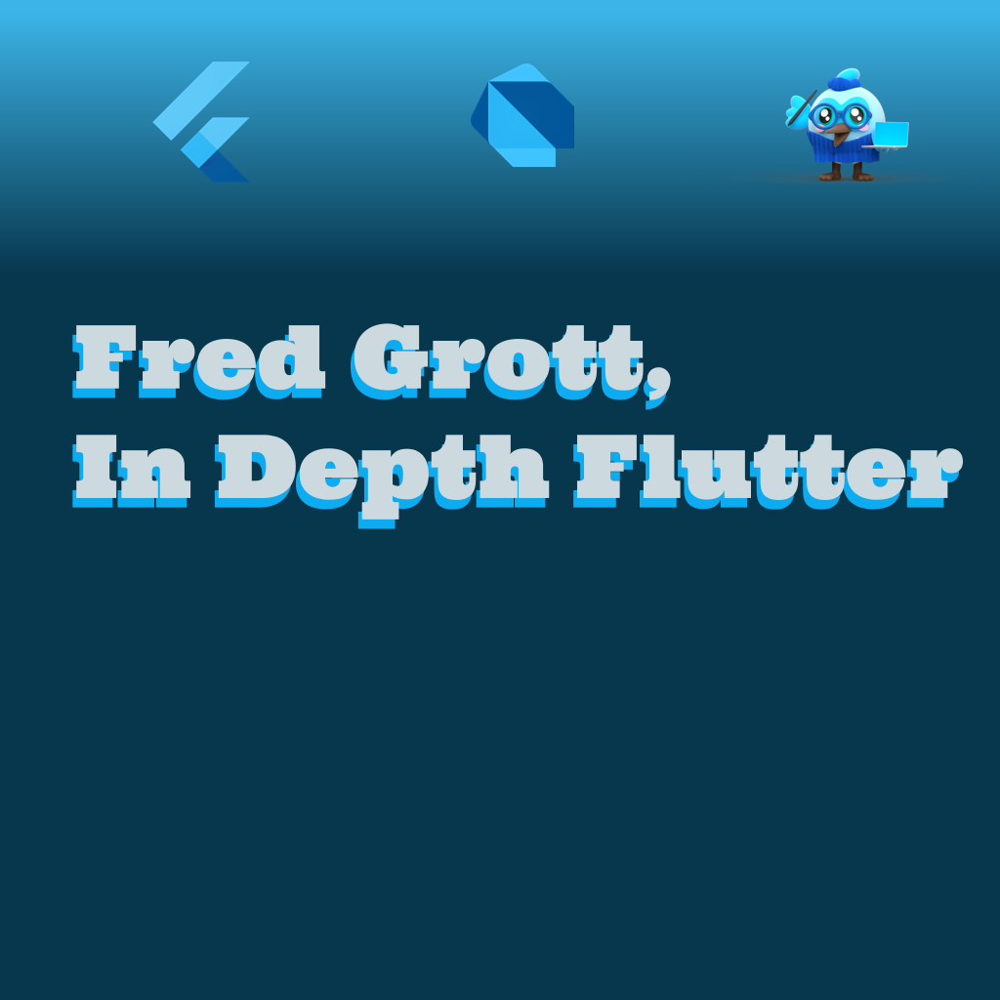

# Fred Grott's In Depth Flutter

This is a work-in-progress projects to Flutter Dev and Design series of books I am writing.

## Projects

Flutter projects that then become subjects of books:

[Missing Best Practices](https://github.com/fredgrott/missing_best_pratices)

I'm converting the Flutter Skeleton App introduced in Flutter 2.5 to a modified app to teach Flutter Best Practices.

## Community Plugins

I contribute to these Flutter Community Plugins:

[Catcher](https://pub.dev/packages/catcher)

[Flutter Platform Widgets](https://pub.dev/packages/flutter_platform_widgets)

## Articles

My Flutter Articles can be found on my Medium blog:

[My Medium Blog](https://fredgrott.meidum.com)

## Contact

You can contact me via Keybase

[My Keybase Profile](https://keybase.io/fredgrott)

## Resources

This is a some different set of resources;

Nielsen Norman Group, One of the top research groups in UI design.
[nn/g](https://www.nngroup.com/)

Donald Norman's free stuff at archive org
[d n at archive org](https://archive.org/search.php?query=creator%3A%22Donald+A.+Norman%22)

Donald Norman's Every Day Things
[d n at archive org](https://archive.org/details/pdfy-9Bb1XUCNFvb5HrMP)

Jakob Nielsen's Usability Engineering
[j n at archive org](https://archive.org/details/usabilityenginee00jak_pv3)

Summary of Clean Arch by Robert Martin is in a gist at:

[clean arch gist](https://gist.github.com/ygrenzinger/14812a56b9221c9feca0b3621518635b)

A Course In Mastering The Art of Mixing Colors by Betty Edwards
[b e at archive org](https://archive.org/details/colorbybettyedwa00bett)

Scott's Dart Design Patterns GitHub repo
[dart](https://github.com/scottt2/design-patterns-in-dart)

Brian Egan's Flutter ToDo Architecture Samples
[flutter arch samples](https://github.com/brianegan/flutter_architecture_samples)

Josef Mueler's Grid Systems In Graphic Design
[j m at archive org](https://archive.org/details/GridSystemsInGraphicDesignJosefMullerBrockmann)

Letterform archive
[letterform archive](https://oa.letterformarchive.org/)

Stephen Coles Anatomy Of Type In Six Letters
[outline Stephen Coles](https://typeanatomy.com/image/640694338958000129)

And yes, it's Stephen Cole's website and there are other gems there.

TypeDetail

[t d](https://typedetail.com/)

Logo Design Love by David Airey
[ l d at archive org](https://archive.org/details/logodesignlogodesignlove)

AIGA Design Archives
[aiga archives](https://designarchives.aiga.org/#/home)

Summary of Dave Trott's Predatory Thinking: A Masterclass In Out-Thinking the Competition
[d t](https://wisewords.blog/book-summaries/predatory-thinking-book-summary/)

